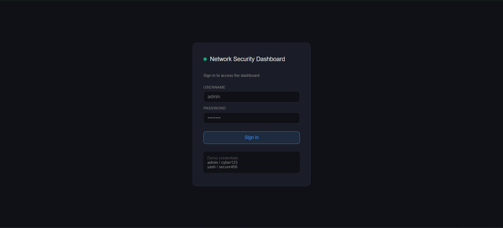
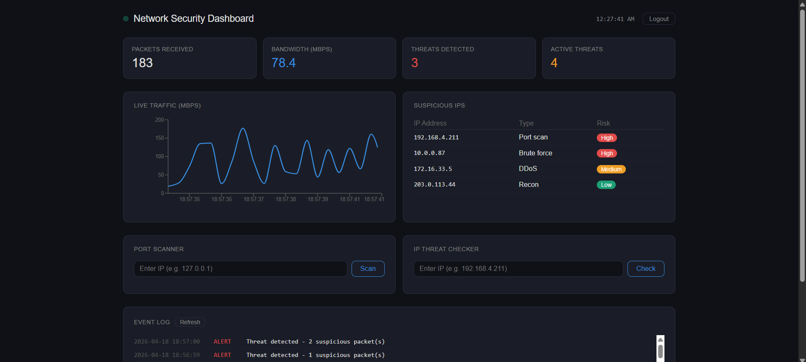

# 🔐 Network Security Dashboard

A real-time network security monitoring dashboard built with Python and React. Detects threats, scans ports, checks IP reputation, and sends email alerts automatically.

## 🌐 Live Demo
- **Frontend:** https://net-security-dashboard.vercel.app
- **Backend API:** https://net-security-dashboard.onrender.com

> **Demo Login:** username: `admin` / password: `cyber123`

## 📸 Screenshots

### Login Page

### Dashboard

## ✨ Features

- **Live Traffic Monitoring** — Real-time bandwidth and packet data streamed via WebSockets every 2 seconds
- **Port Scanner** — Scans any IP address for open ports across 13 common ports (FTP, SSH, HTTP, MySQL, etc.)
- **IP Threat Checker** — Checks any IP against the AbuseIPDB database showing country, abuse score, total reports, and threat status
- **Email Alerts** — Automatically sends Gmail alerts when threats are detected (5 minute cooldown to prevent spam)
- **Event Log** — Timestamped SQLite log of all detected threats persisted in database
- **Login Page** — Simple authentication with multiple user accounts
- **Suspicious IP Table** — Live table of known malicious IPs with threat type and risk level badges
- **Logout** — Secure session management using localStorage tokens

## 🛠️ Tech Stack

| Layer | Technology | Purpose |
|---|---|---|
| Backend | Python 3.12 | Core server language |
| Web Framework | Flask | REST API endpoints |
| WebSockets | Flask-SocketIO | Real-time data streaming |
| CORS | Flask-CORS | Cross-origin requests |
| Database | SQLite | Event log persistence |
| Email | smtplib + Gmail SMTP | Threat alert emails |
| IP Intelligence | AbuseIPDB API | Real IP reputation data |
| Frontend | React 18 | UI framework |
| Charts | Recharts | Live traffic visualization |
| HTTP Client | Axios | API requests |
| Real-time | Socket.IO Client | WebSocket connection |
| Deployment | Render | Backend hosting (free tier) |
| Deployment | Vercel | Frontend hosting (free tier) |
| Version Control | Git + GitHub | Source code management |

## 📁 Project Structure